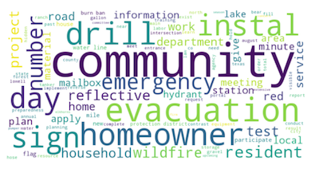
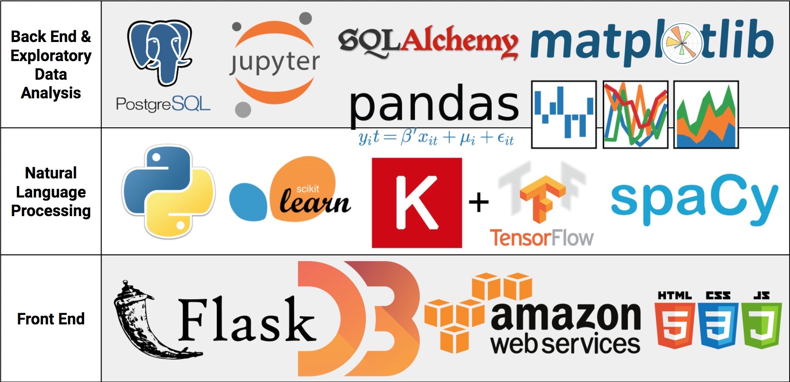

# Firewisdom
### Data Science Immersive Cohort 49 Capstone Project

[Firewisdom Dashboard Website](http://ec2-54-152-139-251.compute-1.amazonaws.com:8080/)

## About Firewise
*"Brush, grass and forest fires don’t have to be disasters. NFPA’s Firewise USA program encourages local solutions for safety by involving homeowners in taking individual responsibility for preparing their homes from the risk of wildfire. Firewise is a key component of Fire Adapted Communities – a collaborative approach that connects all those who play a role in wildfire education, planning and action with comprehensive resources to help reduce risk.*

*The program is co-sponsored by the USDA Forest Service, the US Department of the Interior, and the National Association of State Foresters.*

*To save lives and property from wildfire, NFPA's Firewise USA program teaches people how to adapt to living with wildfire and encourages neighbors to work together and take action now to prevent losses. We all have a role to play in protecting ourselves and each other from the risk of wildfire."*
<sub><b>[Source](http://www.firewise.org/about.aspx)</b></sub>

## Table of Contents
1. [About](#about)
2. [Natural Language Processing Tools](#natural-language-processing-tools)
3. [Dashboard Website](#dashboard-website)
4. [Tech Stack](#tech-stack)
5. [GitHub Folder Structure](#github-folder-structure)

## About
Data and what they can do with it has been a rising topic within the NFPA organization. They are hoping to discover new tools, and best practices to continue on with this project long after my partnership with them is over. We are very excited about this collaboration.

This project has two goals:
1. Natural Language Processing on historical data to gain valuable insights
2. Dashboard tool used to gain more insights into their Communities

## Natural Language Processing Tools
One of my personal goals of this project was to gain more knowledge around different NLP tools. The world is full of free-text fields that are full of useful data just waiting for us to mine! Exploring alternative methodologies around tapping into this data sounded fun and challenging.

### Topic modeling with an end goal
Firewise had 5 main topics they had already mapped the data to:
#### Community Preparedness

#### Distribution Event

#### Education Event

#### Home assessment

#### Mitigation Event


### Recurrent Neural Network ([code](https://github.com/JordanHagan/FireWisdom/blob/master/src/python/RNN.py))
Firewise had already mapped around 2,000 free text fields to the categories they identified.  My theory is that we could do all the normal NLP pre-model text processing, map that resulting text to numbers, put those numbers into a matrix, and run that matrix through a Recurrent Neural Network to hopefully have it learn by the words in the matrix, which category it maps to.

Right now, the RNN is operating at about 75% accuracy.  My theory as to why it is unable to identify which category the text belongs in is because free text fields can have more than 1 category within it. This situation is better handled by NMF or LDA.

### Non-negative Matrix Factorization ([code](https://github.com/JordanHagan/FireWisdom/blob/master/src/python/NMF_or_LDA.py))
*"Non-negative matrix factorization (NMF) is used for feature extraction and is generally seen to be useful when there are many attributes, particularly when the attributes are ambiguous or are not strong predictors. By combining attributes NMF can display patterns, topics, or themes which have importance."*
<sub><b>[Source](https://datascience.stackexchange.com/questions/10299/what-is-a-good-explanation-of-non-negative-matrix-factorization/15438)</b></sub>

*"NMF can be mostly seen as a LDA of which the parameters have been fixed to enforce a sparse solution. So it may not be as flexible as LDA if you want to find multiple topics in single documents, e.g., from long articles. But it could work very well out of box for corpora of short texts. This makes NMF attractive for short text analysis because its computation is usually much cheaper than LDA."*
<sub><b>[Source](http://nbviewer.jupyter.org/github/dolaameng/tutorials/blob/master/topic-finding-for-short-texts/topics_for_short_texts.ipynb)</b></sub>


### Latent Dirichlet Allocation ([code](https://github.com/JordanHagan/FireWisdom/blob/master/src/python/NMF_or_LDA.py))

[LDA Visualization](http://ec2-54-152-139-251.compute-1.amazonaws.com:8080/lda_viz)

*"In natural language processing, latent Dirichlet allocation (LDA) is a generative statistical model that allows sets of observations to be explained by unobserved groups that explain why some parts of the data are similar."*
<sub><b>[Source](https://en.wikipedia.org/wiki/Latent_Dirichlet_allocation)</b></sub>

*"LDA finds topics as a group of words that have high co-occurrences among different documents. On the other side, documents from the similar mixture of topics should also be similar, such that they can be described by these topics in a "compact" way. So ideally the similarity in the latent topic space would imply the the similarity in both the observed word space as well as the document space - this is where the word "latent" in the name come from."*
<sub><b>[Source](http://nbviewer.jupyter.org/github/dolaameng/tutorials/blob/master/topic-finding-for-short-texts/topics_for_short_texts.ipynb)</b></sub>

**LDA is the NLP tool I chose to use for the final results of this project.**  In cases where the topic probabilities should remain fixed per document or in small data settings in which the additional variability is too much, NMF performs better. Because of LDA's handling of the probabilistic priors and the ability of LDA to find and connect documents through the latent topic space it does a better job assigning clearer, easily identifiable topics (and secondary topics) with larger texts.

### NMF vs LDA
#### Comparison between the top 10 words for each topic when identified using LDA vs. NMF
NLP Tool | Home Assessment | Mitigation | Community Preparedness | Distribution Event | Education Event
--- | --- | --- | --- | --- | ---
**LDA** | home, homeowner, assessment, member, information, wildland, conduct, answer, question, risk | brush, chip, road, volunteer, year, hour, community, area, property, chipper | day, community, program, material, county, event, hold, mitigation, member, chip | community, booth, information, event, annual, hold, meeting, sign, attend, home | community, presentation, property, resident, fuel, wildfire, forest, service, provide, discuss
**NMF** | conduct, homeowner, home, assessment, risk, committee, hazard, volunteer, speak, local | brush, chip, road, area, chipper, member, people, community, volunteer, property | county, mitigation, chipper, fuel, program, property, owner, booth, chip, project | community, home, information, assessment, resident, meeting, booth, annual, wildfire, member | day, hold, event, people, chip, community, property, local, plan ,area

Clear lines are drawn between the easily identifiable topics in both LDA and NMF.  However, things start getting a little fuzzy as we continue on.  This is best exemplified when you compare Education Event between the two.
#### Examples of how NMF and LDA mapped text to topics:
Cleaned Text | NMF | LDA Topic 1 | LDA Topic 2
--- | --- | --- | ---
year department hold service day member community invite attend learn department event booth staff volunteer hand material discuss | Distribution Event | Distribution Event | n/a
community brush burn day | Education Event | Community Preparedness | Mitigation Event
boundary clear line boundary flyer distribute resident day fall 7 student 1 faculty 4 resident 2 student man booth local fair fall | Community Preparedness | Distribution Event | n/a
cleanup dead tree brush leave power company 14 property owner total 80 volunteer hour | Education Event | Mitigation Event | n/a
smokeys 65th birthday | Other | Other | n/a

*Both NMF and LDA struggled with small texts without obvious key words in it.  These were grouped into an "other" category*

## Dashboard Website
We can gain more insight into the Firewise Communities now that we have all this information!

**User Interface was designed with help from [Jordan Fallon.](https://github.com/thefetts)**
*I got to write and learn some JavaScript, HTML, and CSS though!*

Jordan and I worked closely together to ensure the data and analytics were accurately represented.  My goal was to create a tool that Firewise is able to use to display current community metrics, the LDA topic modeling, and census data on county population growth.

## Tech Stack


## GitHub Folder Structure
```
├── README.md
├── images
│   └── TechStack.png
├── models
│   ├── LDA_model.pkl
│   ├── NMF_model.pkl
│   ├── lable_model.pkl
│   ├── rnn_model.h5
│   ├── tf_model.pkl
│   └── tfidf_model.pkl
├── src
│   ├── jupyter_notebooks
│   │   ├── Viz_FireWise_LDA.ipynb
│   │   └── firewisdom_eda.ipynb
│   ├── python
│   │   ├── NMF_or_LDA.py
│   │   ├── RNN.py
│   │   ├── classify_text.py (run new data through trained NMF and LDA models)
│   │   ├── intake.py (bring data in from CSVs to psql)
│   │   ├── nlp.py
│   │   └── rnn_classify_text.py
│   ├── sql
│   │   ├── gather_all_data.sql
│   │   ├── make_aggregate_tables.sql
│   │   └── undersample_data.sql
│   └── web_app
│       ├── app.py (flask interface for web app)
│       ├── static
│       │   ├── css
│       │   │   └── styles.css
│       │   ├── images
│       │   │   └── fire_favicon.ico
│       │   └── js
│       │       ├── leaderboard.js
│       │       ├── madness.js
│       │       └── script.js
│       └── templates
│           ├── dashboard.html
│           ├── lda.html
│           └── leaderboard.html
└── tests (Developed a few tests to make sure I was bringing in the data correctly)
    ├── Sample\ Float\ Intake.csv
    ├── Sample\ Int\ Intake.csv
    ├── context.py
    └── test_intake.py
